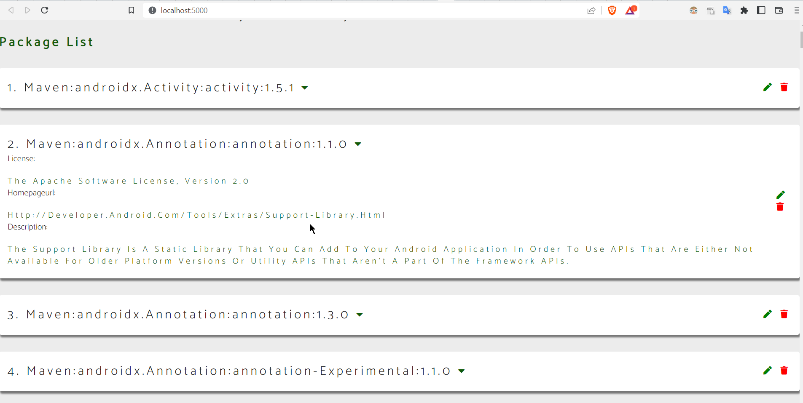

# ORT VIEWER app
[](https://opensource.org/licenses/MIT)

This app consumes the ORT analyser json output and displays the list of dependencies
https://github.com/oss-review-toolkit/ort#details-on-the-tools

```bash
# place the analyzer-result.json inside public folder cause that is how src/App.svelte file is looking for analyzer-result.json file
cd ortviewer
npm i .
npm run dev
```

_Note that you will need to have [Node.js](https://nodejs.org) installed._

## Get started

Install the dependencies...

```bash
cd ortviewer
npm install
```

...then start [Rollup](https://rollupjs.org):

```bash
npm run dev
```

## Display result


GIF


Navigate to [localhost:5000](http://localhost:5000). You should see your app running. Edit a component file in `src`, save it, and reload the page to see your changes.

By default, the server will only respond to requests from localhost. To allow connections from other computers, edit the `sirv` commands in package.json to include the option `--host 0.0.0.0`.
## License
[MIT License](LICENSE)